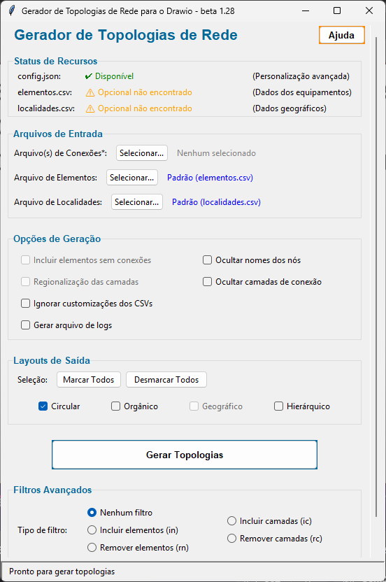
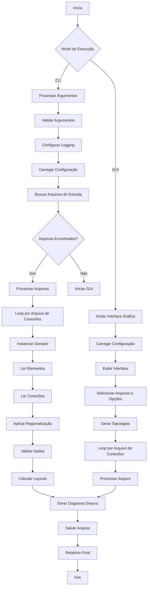
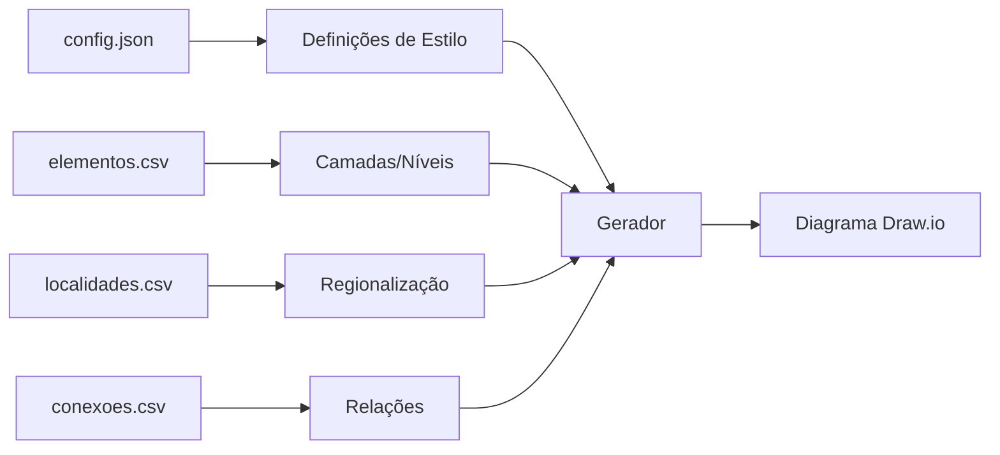

# 🌐 GERADOR DE TOPOLOGIAS DE REDE - DRAWIO

[](https://opensource.org/licenses/MIT)


## 🔍 Visão Geral
Ferramenta para geração automatizada de topologias hierárquicas de redes backbone nacionais, produzindo datasets prontos para visualização em ferramentas como Draw.io.



Ferramenta para geração automática de diagramas de rede (.drawio) a partir de dados de equipamentos e conexões.

## 🔥 Recursos Principais
- **4 layouts**: Circular, Orgânico, Geográfico, Hierárquico
- **Visualizações múltiplas**: Diversas páginas no mesmo diagrama
- **Personalização completa**: Via arquivo `config.json`
- **Regionalização automática**: Ex: `CORE` → `CORE_SUDESTE`
- **Duas interfaces**: CLI (linha de comando) e GUI (gráfica)

## ⚙️ Instalação Rápida

```bash
# Windows/Linux
pip install networkx chardet numpy pillow psutil
```

## 🚀 Como Usar

### Modo Gráfico (GUI)
```bash
python GeradorTopologias.py
```

### Modo Terminal (CLI)
```bash
python GeradorTopologias.py [OPÇÕES] conexoes1.csv conexoes2.csv ...
```

### ⚡ Opções da CLI
| Opção | Descrição |
|-------|-----------|
| `-y`  | Incluir nós sem conexões |
| `-t cog` | Layouts (c=circular, o=orgânico, g=geográfico, h=hierárquico) |
| `-r`  | Ativar regionalização das camadas |
| `-g pasta/` | Diretório com arquivos CSV |
| `-o nc` | Opções: n (sem nomes), c (ocultar conexões) |
| `-d`  | Ignorar customizações nos CSV |

## 📂 Arquivos de Entrada

### 1. conexoes.csv (Obrigatório)
```csv
ponta-a;ponta-b;textoconexao;strokeWidth;strokeColor;dashed;fontStyle;fontSize
RTIC-SPO99-99;RTOC-SPO98-99;Link Principal;2;#036897;0;1;14
```

### 2. elementos.csv (Opcional)
```csv
elemento;camada;nivel;cor;siteid;apelido
RTIC-SPO99-99;INNER-CORE;1;#FF0000;SP01;Core-SP
```

### 3. localidades.csv (Opcional)
```csv
siteid;Localidade;RegiaoGeografica;Latitude;Longitude
SP01;SAOPAULO;Sudeste;23.32.33.S;46.38.44.W
```

> **Nota**: Coordenadas no formato **DMS** (Graus.Minutos.Segundos.Direção)

## ⚙️ Configuração Avançada (config.json)

### Estrutura Principal
```json
{
  "LAYER_COLORS": {
    "INNER-CORE": "#036897",
    "OUTER-CORE": "#0385BE"
  },
  "LAYER_STYLES": {
    "INNER-CORE": {
      "shape": "mxgraph.cisco19.rect",
      "width": 50,
      "height": 50
    }
  },
  "LAYER_DEFAULT_BY_PREFIX": {
    "RTIC": {"camada": "INNER-CORE", "nivel": 1},
    "RTOC": {"camada": "OUTER-CORE", "nivel": 2}
  }
}
```

### Principais Seções
1. **LAYER_COLORS**: Cores padrão por camada
2. **LAYER_STYLES**: Aparência dos equipamentos
3. **LAYER_DEFAULT_BY_PREFIX**: Mapeamento nome→camada
4. **PAGE_DEFINITIONS**: Visões/páginas do diagrama
5. **GEOGRAPHIC_LAYOUT**: Configuração de mapa

## 🛠️ Exemplos Práticos

### 1. Geração completa
```bash
python GeradorTopologias.py -t cogh -r redes.csv
```

### 2. Com diretório customizado
```bash
python GeradorTopologias.py -g meus_dados/ -t o
```

### 3. Opções avançadas
```bash
python GeradorTopologias.py -y -d -o nc -t gh rede_principal.csv
```

## ⚠️ Solução de Problemas

| Problema | Solução |
|----------|---------|
| JSON inválido | Valide em [jsonlint.com](https://jsonlint.com) |
| Nós sobrepostos | Aumente `radius_increment` (circular) ou `min_distance` (geográfico) |
| Sem coordenadas | Nós são posicionados em espiral no centro |
| Regionalização falha | Verifique correspondência de siteid entre arquivos |
| Acentos incorretos | Salve CSVs como UTF-8 |

## 📌 Dicas Importantes
1. Use prefixos do config.json (RTIC, RTOC, RTPR) nos nomes dos equipamentos
2. Para layout geográfico:
   - Arquivos `elementos.csv` e `localidades.csv` são obrigatórios
   - Nós sem siteid vão para camada `SEM_SITEID`
3. Priorize `-g` para organizar seus arquivos:
   ```
   projeto/
   ├── conexoes.csv
   ├── elementos.csv
   ├── localidades.csv
   └── config.json
   ```

## 📤 Saída
Arquivos no formato:  
`NomeArquivo_TIMESTAMP_layout.drawio`  
Ex: `rede_sp_20250615143045_geografico.drawio`

> **Dica final**: Visualize os arquivos em [app.diagrams.net](https://app.diagrams.net/)

## Dados para teste
Use o Gerador de Topologias para Backbone Nacional [https://github.com/flashbsb/Backbone-Network-Topology-Generator] para criar os arquivos conexoes.csv, elementos.csv e localidades.csv (aplicativo irá gerar a massa de dados de teste).

## Fluxo do Programa




🔗 **Repositório Oficial**:  
https://github.com/flashbsb/Backbone-Network-Topology-Generator

📜 **Licença**:  
[MIT License](https://github.com/flashbsb/Network-Topology-Generator-for-Drawio/blob/main/LICENSE)
