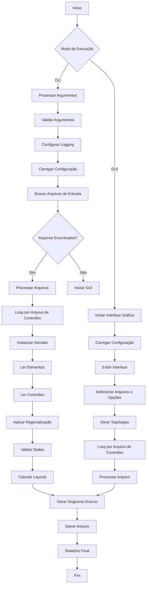
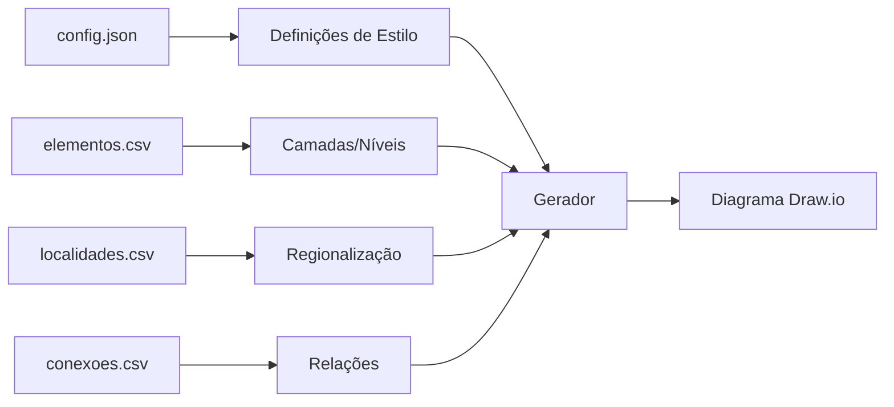

# 🌐 GERADOR DE TOPOLOGIAS DE REDE PARA O DRAWIO

[](https://opensource.org/licenses/MIT)


### 🧩 Facilitando a Documentação de Redes com um Clique

Você trabalha com redes complexas e precisa gerar topologias organizadas e claras?

Conheça o **Gerador de Topologias de Redes para Draw\.io**: uma ferramenta que transforma arquivos CSV em diagramas `.drawio` prontos para uso. Ideal para quem atua com ISPs, backbones, operadoras e redes corporativas.

🔹 **O que ele faz?**
Gera diagramas de rede automaticamente a partir de arquivos simples (CSV), permitindo visualizar conexões e elementos com diferentes estilos, formas, camadas e layouts.

🔹 **Para que serve?**
- Documentar infraestrutura
- Visualizar backbone ou rede regional
- Ajudar no suporte e troubleshooting
- Automatizar relatórios técnicos e operacionais

🔧 **Recursos em destaque**:

* 4 tipos de layout: Circular, Orgânico, Geográfico e Hierárquico
* Interface gráfica (GUI) e linha de comando (CLI)
* Regionalização automática (baseada em coordenadas)
* Legendas automáticas, filtros por camada e suporte a nós sem localização
* Personalização avançada com `config.json` (cores, formas, estilos, páginas)
* Integração com mapas geográficos e DWDM/PTT/Reflectors

🎯 **Fácil de usar**

* Use sem complicações no modo gráfico
* Ou automatize com linha de comando
* Compatível com Windows, Linux e Mac

📎 Tudo que você precisa são arquivos CSV com conexões das ponta-a e ponta-b dos elementos e, se quiser, coordenadas (camadas regionalizadas ou topologia geográfica).

🔗 Repositório no GitHub:
[https://github.com/flashbsb/Network-Topology-Generator-for-Drawio](https://github.com/flashbsb/Network-Topology-Generator-for-Drawio)

📉 Reduza horas de trabalho manual e gere topologias consistentes com apenas alguns cliques.

\#Redes #NetworkTopology #Drawio #Automacao #InfraestruturaTI #Backbone #Python #Telecom

---

## 🔍 Visão Geral
Ferramenta para geração automatizada de diagramas de rede (.drawio) através das informações das conexões entre elementos.


## 🔥 Recursos Principais
- **4 layouts**: Circular, Orgânico, Geográfico, Hierárquico
- **Visualizações múltiplas**: Diversas páginas no mesmo diagrama
- **Personalização completa**: Via arquivo `config.json`
- **Regionalização automática**: Ex: `CORE` → `CORE_SUDESTE`
- **Duas interfaces**: CLI (linha de comando) e GUI (gráfica)

## ⚙️ Instalação das dependências para execução do script

# Windows
1. Abra Microsoft Store
2. Busque "Python 3.12+"
3. Clique em Instalar
4. Instalar dependências Python (CMD/PowerShell):
```bash
python -m pip install networkx chardet numpy pillow psutil
```

## Criar atalho no Windows para abrir a interface gráfica diretamente (Opcional)

### **Passo a Passo:**
1. **Crie um novo atalho:**
   - Clique com o botão direito do mouse em uma área vazia da área de trabalho.
   - Selecione **Novo** > **Atalho**.

2. **Defina o comando:**
   - No campo **"Digite o local do item"**, insira:
     ```cmd
     cmd.exe /c python "c:\caminho\GeradorTopologias.py" & pause
     ```
     - Explicação:
       - `cmd.exe /c`: Abre o prompt de comando para executar o script.
       - `pause`: Mantém a janela aberta após a execução (útil para ver erros).  
       *(Remova `& pause` se não quiser que a janela permaneça aberta)*.

3. **Nomeie o atalho:**
   - Dê um nome (ex: `GeradorTopologias`) e clique em **Concluir**.

4. **Altere o ícone (opcional):**
   - Clique com o botão direito no atalho > **Propriedades**.
   - Na aba **Atalho**, clique em **Alterar Ícone...**.
   - Procure ícones em:
     - `C:\Windows\System32\SHELL32.dll`
     - Ou use um arquivo `.ico` personalizado.

# Linux (Debian/Ubuntu)
1. Instalar Python 3 e pip (apt):
```bash
sudo apt update && sudo apt install python3 pip python3-tk -y
```
2. Instalar dependências Python
```bash
python3 -m pip install networkx chardet numpy pillow psutil
```

## 🚀 Como Usar
Baixe os arquivos GeradorTopologias.py e config.json para a pasta em que irá trabalhar.

### Modo Gráfico (GUI)
```bash
python GeradorTopologias.py
```

### Modo Terminal (CLI)
```bash
python GeradorTopologias.py [OPÇÕES] conexoes1.csv conexoes2.csv ...
```

### ⚡ Opções da CLI
| Opção | Descrição |
|-------|-----------|
| `-y`  | Incluir nós sem conexões |
| `-t cog` | Layouts (c=circular, o=orgânico, g=geográfico, h=hierárquico) |
| `-r`  | Ativar regionalização das camadas |
| `-g pasta/` | Diretório com arquivos CSV |
| `-o nc` | Opções: n (sem nomes), c (ocultar conexões) |
| `-d`  | Ignorar customizações nos CSV |

## ⚙️ Configuração Avançada (config.json)

### Principais Seções
1. **LAYER_COLORS**: Cores padrão por camada
2. **LAYER_STYLES**: Aparência dos equipamentos
3. **LAYER_DEFAULT_BY_PREFIX**: Mapeamento nome→camada
4. **PAGE_DEFINITIONS**: Visões/páginas do diagrama
5. **GEOGRAPHIC_LAYOUT**: Configuração de mapa
> para não ocorrer sobreposição dos nós, os elementos poderão estar deslocados no mapa

## 📂 Arquivos de Entrada

### 1. conexoes.csv (Obrigatório)
```csv
ponta-a;ponta-b;textoconexao;strokeWidth;strokeColor;dashed;fontStyle;fontSize
RTIC-SPO99-99;RTOC-SPO98-99;Link Principal;2;#036897;0;1;14
```

### 2. elementos.csv (Opcional)
```csv
elemento;camada;nivel;cor;siteid;apelido
RTIC-SPO99-99;INNER-CORE;1;#FF0000;SP01;Core-SP
```

### 3. localidades.csv (Opcional)
```csv
siteid;Localidade;RegiaoGeografica;Latitude;Longitude
SP01;SAOPAULO;Sudeste;23.32.33.S;46.38.44.W
```

> **Nota**: Coordenadas no formato **DMS** (Graus.Minutos.Segundos.Direção)

## 🛠️ Exemplos Práticos

### 1. Geração completa
```bash
python GeradorTopologias.py -t cogh -r redes.csv
```

### 2. Com diretório customizado
```bash
python GeradorTopologias.py -g meus_dados/ -t o
```

### 3. Opções avançadas
```bash
python GeradorTopologias.py -y -d -o nc -t gh rede_principal.csv
```

## ⚠️ Solução de Problemas

| Problema | Solução |
|----------|---------|
| JSON inválido | Valide em [jsonlint.com](https://jsonlint.com) |
| Nós sobrepostos | Aumente `radius_increment` (circular) ou `min_distance` (geográfico) |
| Sem coordenadas | Nós são posicionados em espiral no centro |
| Regionalização falha | Verifique correspondência de siteid entre arquivos |
| Acentos incorretos | Salve CSVs como UTF-8 |
| Nós vermelhos sem formatação e localização errada | Nó sem correspondência de siteid no arquivo localidades.csv |
| Posição dos elementos na topologia circular | Alterar a ordem do elemento da camada no csv |
| Posição na coordenada errada na topologia geográfica | Trabalhar com massa de dados menores. Isto ocorre para evitar sobreposição |

## 📌 Dicas Importantes
1. Todas as definições de padrão dos nós, conexões, camadas, paginas e layouts devem ser realizados no config.json
2. Somente com o arquivo conexoes.csv com a informação da ponta-a e a ponta-b, é possivel gerar as topologias (com exceção a topologia geografica e criação das camadas regionalizadas)
3. As informações de customização (as que são opcionais nos csv´s) tem preferência sobre as definições do config.json
4. Customize o prefixo do config.json dos nomes dos equipamentos para determinar sua camada
5. Para layout geográfico e regionalização das camadas:
   - Arquivos `elementos.csv` e `localidades.csv` são obrigatórios
   - Nós sem siteid vão para camada `SEM_SITEID`
6. Na cli, ao executar o script
   -  na mesma pasta dos arquivos de massa de dados, basta informar os arquivos de conexoes (pode ser mais de um)
   ```
   projeto/
   ├── conexoes.csv
   ├── elementos.csv
   ├── localidades.csv
   └── config.json
   ```

## 📤 Saída
Arquivos no formato:  
`NomeArquivo_TIMESTAMP_layout.drawio`  
Ex: `rede_sp_20250615143045_geografico.drawio`

> **Dica final**: Visualize os arquivos em [app.diagrams.net](https://app.diagrams.net/) ou para windows instale o drawio pelo Microsoft Store

## Como gerar os arquivos de testes para carga do script
Use o Gerador de Topologias para Backbone Nacional [https://github.com/flashbsb/Backbone-Network-Topology-Generator] para criar os arquivos conexoes.csv, elementos.csv e localidades.csv.
> aplicativo irá gerar a massa de dados para teste

## Fluxo do Programa




### Análise do Script

O script é uma ferramenta avançada para geração automática de diagramas de rede no formato do Draw.io.

### 1. **Objetivo Principal**
Transformar dados estruturados de equipamentos e conexões de rede em diagramas visuais profissionais com múltiplos layouts e camadas.

### 2. **Arquivos de Entrada**
- **`conexoes.csv` (Obrigatório)**: 
  - Formato: `ponta-a;ponta-b;textoconexao;strokeWidth;strokeColor;dashed;fontStyle;fontSize`
  - Define as ligações entre dispositivos
- **`elementos.csv` (Opcional)**:
  - Formato: `elemento;camada;nivel;cor;siteid;apelido`
  - Atribui propriedades aos equipamentos
- **`localidades.csv` (Opcional)**:
  - Formato: `siteid;Localidade;RegiaoGeografica;Latitude;Longitude`
  - Fornece dados geográficos para posicionamento

### 3. **Arquivo de Configuração (`config.json`)**
Define todo o comportamento visual:
- **`LAYER_COLORS`**: Cores por tipo de equipamento
- **`LAYER_STYLES`**: Formas e propriedades visuais
- **`LAYER_DEFAULT_BY_PREFIX`**: Mapeamento automático de equipamentos para camadas
- **`PAGE_DEFINITIONS`**: Visões pré-definidas (ex: "CORE", "EDGE")
- **Parâmetros de Layout**: Configurações específicas para cada algoritmo

### 4. **Algoritmos de Layout Implementados**
1. **Circular**:
   - Disposição em anéis concêntricos por nível
   - Configuração: raio base e incremento

2. **Orgânico**:
   - Algoritmo de força (`spring_layout` do NetworkX)
   - Parâmetros ajustáveis: distância entre nós, iterações

3. **Geográfico**:
   - Posicionamento por coordenadas geográficas
   - Tratamento especial para nós sem localização
   - Suporte a imagens de fundo (mapas)
> para não ocorrer sobreposição dos nós, os elementos poderão estar deslocados no mapa

4. **Hierárquico**:
   - Organização vertical por níveis
   - Espaçamento configurável entre camadas

### 5. **Funcionalidades Avançadas**
- **Regionalização Automática**:
  - Adiciona sufixos regionais às camadas (ex: `CORE_SUDESTE`)
  - Requer dados geográficos completos

- **Tratamento de Erros**:
  - Nós sem coordenadas são posicionados em espiral
  - Validação de arquivos e codificação automática

- **Otimizações**:
  - Escalonamento dinâmico de elementos
  - Prevenção de sobreposição (layout geográfico)
  - Controle de memória e performance

### 6. **Sistema de Camadas**
- **Estrutura Multi-nível**:
  ```plaintext
  INNER-CORE (Nível 1)
  │
  ├── OUTER-CORE (Nível 2)
  │
  ├── EDGE (Nível 5)
  │   │
  │   └── ACCESS-EDGE (Nível 6)
  │
  └── SEM_SITEID (Nós sem localização)
  ```
- **Visões Filtradas**:
  - Exibição seletiva por tipo de equipamento
  - Legendas automáticas

### 7. **Geração de Saída**
- Formato `.drawio` (XML estruturado)
- Recursos visuais:
  - Ícones específicos por tipo de equipamento
  - Estilos de conexão personalizáveis
  - Elementos bloqueáveis para diagramas finais

### 8. **Mecanismos Especiais**
- **Detecção de Codificação**: Identifica automaticamente charset dos CSVs
- **Tratamento de Órfãos**: Opção para incluir/excluir nós isolados
- **Escalonamento Dinâmico**: Ajusta tamanhos conforme densidade da rede
- **Controle de Versões**: Sistema de versionamento integrado

### 9. **Modos de Operação**
1. **Interface Gráfica (GUI)**:
   - Seleção visual de arquivos
   - Pré-visualização de recursos disponíveis
   - Controle interativo de parâmetros

2. **Linha de Comando (CLI)**:
   - Opções avançadas via argumentos
   - Processamento em lote de múltiplos arquivos
   - Geração de logs detalhados

### Fluxo de Processamento Detalhado
```python
def process_file():
  1. Carregar dados dos CSVs
  2. Construir grafo de rede
  3. Aplicar regionalização (se ativado)
  4. Calcular posições conforme layout
  5. Gerar XML com:
     - Páginas múltiplas
     - Camadas hierárquicas
     - Estilos visuais
  6. Validar e salvar arquivo
```

### Casos de Uso Típicos
1. **Documentação de Infraestrutura**:
   ```bash
   python GeradorTopologias.py -t co -r infra.csv
   ```
2. **Planejamento de Expansão**:
   ```bash
   python GeradorTopologias.py -t gh -e novos_equipamentos.csv
   ```
3. **Análise Geográfica**:
   ```bash
   python GeradorTopologias.py -t g -s localidades_custom.csv
   ```

O script combina técnicas de processamento de dados, algoritmos de grafos e geração de visualizações para criar uma solução completa de documentação de redes, com ênfase em flexibilidade e qualidade visual.

🔗 **Repositório Oficial**:  
https://github.com/flashbsb/Backbone-Network-Topology-Generator

📜 **Licença**:  
[MIT License](https://github.com/flashbsb/Network-Topology-Generator-for-Drawio/blob/main/LICENSE)
