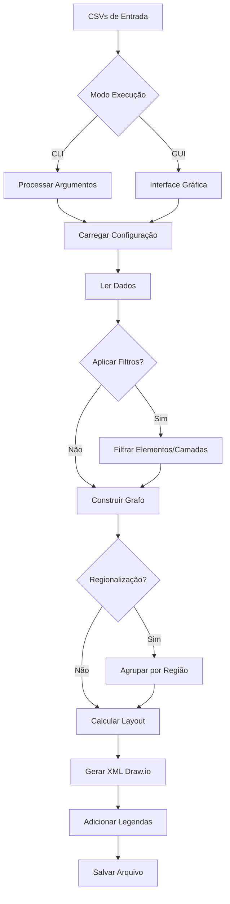

# 🌐 GERADOR DE TOPOLOGIAS DE REDE PARA O DRAWIO

[](https://opensource.org/licenses/MIT)


### 🧩 Transforme dados de rede em diagramas profissionais com um clique

O **Gerador de Topologias de Redes para Draw.io** é uma ferramenta avançada que converte arquivos CSV em diagramas `.drawio` completos e organizados. Ideal para ISPs, operadoras de telecomunicações, administradores de redes corporativas e profissionais de infraestrutura.

🔧 **Recursos em destaque**:
* 4 algoritmos de layout: Circular, Orgânico, Geográfico e Hierárquico
* Interface gráfica (GUI) e linha de comando (CLI)
* Regionalização automática (ex: CORE → CORE_SUDESTE)
* Legendas automáticas e múltiplas páginas/visões
* Personalização avançada via `config.json`
* Suporte a mapas geográficos e elementos DWDM/PTT
* Filtragem avançada de elementos e camadas
* Opção para ocultar nomes dos nós e camadas de conexão
* Tratamento especial para elementos sem localização geográfica
* Prevenção de sobreposição de nós em layout geográfico

---

## 🔍 Visão Geral
Ferramenta para geração automatizada de diagramas de rede (.drawio) a partir de:
- Conexões entre equipamentos (`conexoes.csv`)
- Dados dos equipamentos (`elementos.csv`)
- Localizações geográficas (`localidades.csv`)


## ⚙️ Instalação das dependências para execução do script

# Windows
1. Abra Microsoft Store
2. Busque "Python 3.12+"
3. Clique em Instalar
4. Instalar dependências Python (CMD/PowerShell):
```bash
python -m pip install networkx chardet numpy pillow psutil
```

## Criar atalho no Windows para abrir a interface gráfica diretamente (Opcional)

### **Passo a Passo:**
1. **Crie um novo atalho:**
   - Clique com o botão direito do mouse em uma área vazia da área de trabalho.
   - Selecione **Novo** > **Atalho**.

2. **Defina o comando:**
   - No campo **"Digite o local do item"**, insira:
     ```cmd
     cmd.exe /c python "c:\caminho\GeradorTopologias.py" & pause
     ```
     - Explicação:
       - `cmd.exe /c`: Abre o prompt de comando para executar o script.
       - `pause`: Mantém a janela aberta após a execução (útil para ver erros).  
       *(Remova `& pause` se não quiser que a janela permaneça aberta)*.

3. **Nomeie o atalho:**
   - Dê um nome (ex: `GeradorTopologias`) e clique em **Concluir**.

4. **Altere o ícone (opcional):**
   - Clique com o botão direito no atalho > **Propriedades**.
   - Na aba **Atalho**, clique em **Alterar Ícone...**.
   - Procure ícones em:
     - `C:\Windows\System32\SHELL32.dll`
     - Ou use um arquivo `.ico` personalizado.

# Linux (Debian/Ubuntu)
1. Instalar Python 3 e pip (apt):
```bash
sudo apt update && sudo apt install python3 pip python3-tk -y
```
2. Instalar dependências Python
```bash
python3 -m pip install networkx chardet numpy pillow psutil
```

## 🚀 Como Usar

### Modo Gráfico (GUI)
```bash
python GeradorTopologias.py
```

### Modo Terminal (CLI)
```bash
python GeradorTopologias.py [OPÇÕES] arquivo_conexoes.csv
```

### ⚡ Opções da CLI
| Opção | Descrição | Exemplo |
|-------|-----------|---------|
| `-y`  | Incluir nós sem conexões | `-y` |
| `-t cog` | Layouts (c=circular, o=orgânico, g=geográfico, h=hierárquico) | `-t co` |
| `-r`  | Ativar regionalização | `-r` |
| `-g DIR` | Diretório com arquivos CSV | `-g dados/` |
| `-o nc` | Opções: n (sem nomes), c (ocultar conexões) | `-o n` |
| `-d`  | Ignorar customizações nos CSV | `-d` |
| `-f FILTRO` | Filtrar elementos/camadas | `-f "in:RTIC;RTOC"` |
| `-l`  | Gerar arquivo de logs | `-l` |
| `-v`  | Modo verboso | `-v` |

## 📂 Arquivos de Entrada

### 1. conexoes.csv (Obrigatório)
```csv
ponta-a;ponta-b;textoconexao;strokeWidth;strokeColor;dashed;fontStyle;fontSize
RTIC-SPO99-99;RTOC-SPO98-99;Link Principal;2;#036897;0;1;14
```

### 2. elementos.csv (Opcional)
```csv
elemento;camada;nivel;cor;siteid;apelido
RTIC-SPO99-99;INNER-CORE;1;#FF0000;SP01;Core-SP
```

### 3. localidades.csv (Opcional)
```csv
siteid;Localidade;RegiaoGeografica;Latitude;Longitude
SP01;SAOPAULO;Sudeste;23.32.33.S;46.38.44.W
```

> **Formato de coordenadas**: Graus.Minutos.Segundos.Direção (ex: 23.32.33.S)

## ⚙️ Configuração Avançada (config.json)

### Seções Principais
```json
{
  "LAYER_DEFAULT_BY_PREFIX": {
    "RTIC": {"camada": "INNER-CORE", "nivel": 1},
    "RTOC": {"camada": "OUTER-CORE", "nivel": 2}
  },
  "LAYER_COLORS": {
    "INNER-CORE": "#036897",
    "OUTER-CORE": "#0385BE"
  },
  "LAYER_STYLES": {
    "INNER-CORE": {
      "shape": "mxgraph.cisco19.rect",
      "prIcon": "router",
      "width": 50,
      "height": 50
    }
  },
  "PAGE_DEFINITIONS": [
    {"name": "VISÃO GERAL", "visible_layers": null}
  ],
  "GEOGRAPHIC_LAYOUT": {
    "canvas_width": 5000,
    "background_image": {
      "url": "mapa_brasil.png"
    }
  }
}
```

### Principais Parâmetros
1. **LAYER_DEFAULT_BY_PREFIX**: Mapeia prefixos para camadas/níveis
2. **LAYER_COLORS**: Cores padrão por camada
3. **LAYER_STYLES**: Aparência dos equipamentos (formas, ícones, tamanhos)
4. **PAGE_DEFINITIONS**: Visões/páginas do diagrama
5. **Layouts**: Parâmetros específicos para cada algoritmo:
   - `CIRCULAR_LAYOUT`: center_x, center_y, base_radius
   - `ORGANIC_LAYOUT`: k_base, iterations_per_node
   - `GEOGRAPHIC_LAYOUT`: canvas_width, background_image
   - `HIERARCHICAL_LAYOUT`: vertical_spacing

## 🛠️ Exemplos Práticos

### 1. Geração completa com regionalização
```bash
python GeradorTopologias.py -t cogh -r redes.csv
```

### 2. Filtrar elementos específicos
```bash
python GeradorTopologias.py -f "in:RTIC;RTOC" -t c backbone.csv
```

### 3. Opções avançadas
```bash
python GeradorTopologias.py -y -d -o nc -t gh -l rede_principal.csv
```

## ⚠️ Solução de Problemas

| Problema | Solução |
|----------|---------|
| Nós sobrepostos | Aumente `radius_increment` (circular) ou `min_distance` (geográfico) |
| Elementos vermelhos no centro | Nós sem siteid no `localidades.csv` |
| Layout geográfico não gerado | Verifique `elementos.csv` e `localidades.csv` |
| JSON inválido | Valide em [jsonlint.com](https://jsonlint.com) |
| Nós fora do diagrama | Ajuste `center_x/center_y` no config.json |
| Conexões sobrepostas | Ative prevenção em `CONNECTION_STYLE_BASE` |

## 📌 Dicas Importantes

1. **Hierarquia de Configurações**:
   - `config.json` > Opções CLI > Dados CSV
   - Use `-d` para ignorar customizações nos CSVs

2. **Layout Geográfico**:
   - Requer `elementos.csv` e `localidades.csv`
   - Nós sem siteid são posicionados em espiral no centro
   - Para evitar sobreposição, aumente `min_node_distance`

3. **Filtragem Avançada**:
   ```bash
   # Somente elementos RTIC/RTOC:
   -f "in:RTIC;RTOC" 
   
   # Remover camadas METRO/ACCESS:
   -f "rc:METRO;ACCESS"
   ```

4. **Performance**:
   - Para redes grandes (>500 nós), prefira layout Circular ou Hierárquico
   - Use `-l` para gerar logs detalhados

## 📤 Saída
Arquivos no formato:  
`NomeArquivo_TIMESTAMP_layout.drawio`  
Ex: `rede_sp_20250615143045_geografico.drawio`

> **Visualize os arquivos**: [app.diagrams.net](https://app.diagrams.net/) ou Draw.io Desktop

## 🔄 Fluxo de Processamento



🔗 **Repositório Oficial**:  
https://github.com/flashbsb/Network-Topology-Generator-for-Drawio

📜 **Licença**:  
[MIT License](https://github.com/flashbsb/Network-Topology-Generator-for-Drawio/blob/main/LICENSE)
